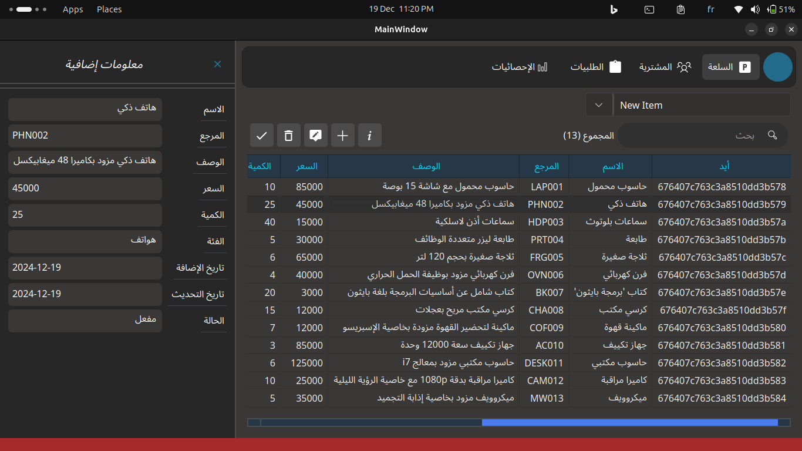

# تطبيق إدارة الطلبات

تطبيق مكتبي لإدارة المنتجات، العملاء، والطلبات باستخدام PyQt5 و MongoDB.

---

## **مميزات التطبيق**
- **إدارة المنتجات**:
  - عرض قائمة المنتجات مع تفاصيل مثل الاسم، المرجع، السعر، الكمية، وغيرها.
  - إضافة منتجات جديدة.
  - تعديل وحذف المنتجات.
  - عرض التفاصيل الكاملة لكل منتج.

- **إدارة العملاء**:
  - عرض قائمة العملاء مع تفاصيل مثل الاسم، البريد الإلكتروني، رقم الهاتف، وغيرها.
  - إضافة عملاء جدد.
  - تعديل وحذف العملاء.
  - عرض التفاصيل الكاملة لكل عميل.

- **إدارة الطلبات**:
  - إنشاء طلب جديد وربط المنتجات مع العملاء.
  - تعديل حالة الطلب (مثل "قيد الانتظار"، "تم الشحن"، "تم التوصيل").
  - عرض قائمة الطلبات مع تفاصيل مثل العميل، حالة الطلب، الإجمالي.
  - حذف الطلبات وعرض تفاصيلها.

- **واجهة مستخدم ديناميكية باللغة العربية**:
  - دعم كامل للغة العربية.
  - تصميم بسيط وسهل الاستخدام.

---

## **التقنيات المستخدمة**
- **لغة البرمجة**: Python
- **واجهة المستخدم**: PyQt5
- **قاعدة البيانات**: MongoDB
- **المكتبات الإضافية**:
  - `pymongo` للتعامل مع قاعدة البيانات.
  - `bson` للتعامل مع ObjectId.
  - `rich` لتنسيق السجلات.

---

## **طريقة التشغيل**
1. تأكد من تثبيت المتطلبات:
   ```bash
   pip install -r requirements.txt
   ```
2. قم بتشغيل خادم MongoDB.
3. شغل التطبيق:
    ```bash
    python main.py
    ```

## **كيفية التفاعل مع التطبيق**

    1. إدارة المنتجات:
        لعرض المنتجات، اختر "المنتجات" من القائمة الرئيسية.
        لإضافة منتج جديد، اضغط على زر "إضافة منتج".
        لتعديل أو حذف منتج، اختر المنتج من القائمة واضغط على الزر المناسب.

    2. إدارة العملاء:
        لعرض العملاء، اختر "العملاء" من القائمة الرئيسية.
        لإضافة عميل جديد، اضغط على زر "إضافة عميل".
        لتعديل أو حذف عميل، اختر العميل من القائمة واضغط على الزر المناسب.

    3. إدارة الطلبات:
        لإنشاء طلب جديد، اضغط على زر "إضافة طلب".
        لتعديل حالة الطلب، اضغط على الزر بجانب حالة الطلب وحدد الحالة الجديدة.
        لحذف طلب، اختر الطلب من القائمة واضغط على "حذف".

---

### **ملاحظات**
- تأكد من تعديل `requirements.txt` وكتابة المكتبات المطلوبة إذا لم تكن موجودة.
- أضف أو عدّل أي معلومات إضافية إذا كنت بحاجة إلى تضمين تفاصيل أكثر.

هل ترغب في أي تعديلات إضافية على هذا الملف؟ 😊


## **قائمة المنتجات**


## **تفاصيل الطلب**

